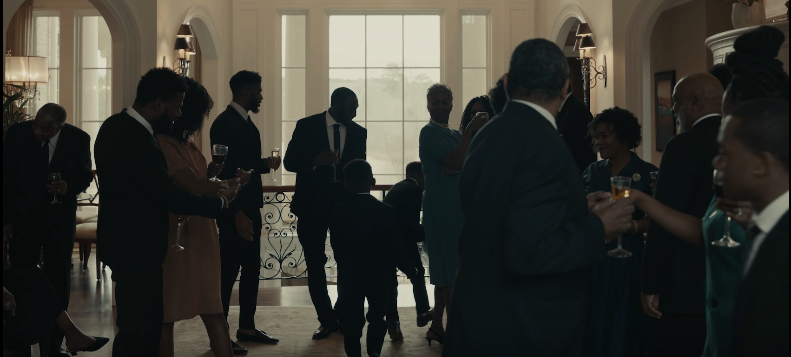
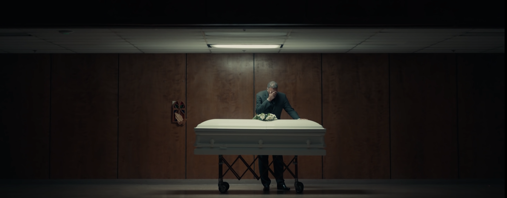

Today I am going to analyze the _“a lot”_ video clip by 21 Savage. It required me to spend a lot of time to make a research to fully understand the message of 21 Savage and now I want to share my thoughts on this message with you. Please note that I will mainly focus on the part of Joseph because the part of J. Cole requires to do an analysis of the life of another person and that would require a lot of extra work.

Diving into an analysis of multimodal resource is not an easy thing to do and I decided to split the analysis into two big parts to make it more clear for my audience. Firstly, we are going to look at **iconography** and **form** used in the clip and then will switch to the semiotics of _“a lot”_. In both parts, there will be a focus on how certain techniques contribute to the overall purpose and persuasion of the text.

## Iconography and Form

Some of you might be not familiar with the term iconography. Let me state the definition of this term given by the scientist Panofsky. 

> _Iconology helps us to study the subject-matter of works of art at each of the levels._

In simple words, iconography studies _“what is being shown”_ in a particular text while form operates as its logical continuation and studies _“the manner in which it is shown”_. These two are closely connected with each other and this is the reason why I decided to not separate them in my analysis.

According to Panofsky, there are three levels the person should explore in order to fully discover iconography and form behind a text. These are **primary**, **secondary** and **intrinsic** levels. I will follow these guidelines created by Panofsky to make my analysis more organized and simple to read.

The primary or natural level is also called a _“what-you-see-is-what-you-get”_ level. This is all about just looking at things and not diving deeper into its meanings. For this level, I will try to focus on the location, time of a day and what is basically shown in _“a lot”_.

At figure 1, you can see one of the first scenes shown in the clip. As we could notice, it looks like a family of the main artist. Looking at figures 2 and 3 reveals that all actions in the video take place in a rich vacation home in the evening. Furniture in the house looks very rich and the atmosphere of luxury is coming out from the text. In the scene shown in figure 4, we are also shown the wealthy table full of food. All these scenes are accompanied by the line of 21 Savage:

> _How much money you got? (A lot)_

Figure 1. Family of 21 Savage

Figure 2. House shown in the clip

Figure 3. House shown in the clip

Figure 4. Food table

Richness and wealth are probably the first things that come to your mind while looking at _“a lot”_. This is actually _“the manner”_ in which the video is presented to its audience. We can also note the dressing of people in the frame. Almost all of them wear rich black suits which also make viewers think about opulence.

Let’s now dive a bit deeper and move to the secondary (conventional level). For the case of this level, we will try to explore _“disguised symbolism”_ by bringing our existing literacy and cultural knowledge on the scene. I am not a big fan of 21 Savage and it required me to make a bit of research to find out what he hides _“between the lines”_ in this song. 

Firstly, let’s understand the meaning behind the questions that Joseph asks. All questions he asks is directed to himself and this is hard to call it a dialogue. The song _“a lot”_ is one of the songs from the album of 21 Savage called _“i am > i was”_. Probably, this kind of process of asking questions and answering them is a conversation between _“old”_ him and _“new”_ him which supports the idea of an album showing his transformation. We can also note that the question _“How much money you got?”_ is followed by _“How many problems you got?”_. The idea of these lines is borrowed from the song of another popular rapper The Notorious B.I.G who used the following lines:

> _I don’t know what they want from me. It’s like the more money we come across. The more problems we see._

The purpose of borrowing lines from another famous rapper is to show that 21 Savage is not the only one person who understands the threats of money and that adds more value to his words.

The deepest part of the video happens when Joseph starts to read about his brother’s death:

> _My brother lost his life and it turned me to a beast._

It appears that the brother of Joseph called Tayman was killed in a drug deal and this is exactly what is shown in the clip. However, pay close attention to _“the manner”_ it was shown. Compare figures 5 and 6 and note that there is a _“smooth”_ transition from the rich house to the upcoming tragedy. The brother of Joseph keeps in the same position both in the house and in the next scene where he has a gun to his head. This technique of _“smooth”_ transition is also used for showing the lives of other family members of 21 Savage. The purpose of this is to highlight how the life of his family members changed since his transition. Again it supports the overall idea of the album called _“i am > i was”_ and this phrase also refers to the state of his family before and after.

Figure 5. Brother in the house

Figure 6. Brother with a gun to his head

We now will focus on the last and deepest level of iconography - intrinsic level. Panofsky described this one as _“unconscious process”_ of looking at things in a text. For him, it is the _“ultimate goal”_ of iconology because it reveals the message of an author of the text. Let’s try to penetrate _“a lot”_ on this level of iconology. I should probably note that everything I am going to say further is my personal opinion and it obviously could be different for any of you. There is no writing by 21 Savage where he describes the message of his song. This message is determined independently by each of us and we do it unconsciously. 

I believe that Joseph’s message in _“a lot”_ is all about supporting the idea of _“i am > i was”_. He shows misfortunes made to him and his family members and underlines the wealth in which they live now. However, he does not forget the fact that money brings problems too and that understanding makes him better than he was in the past.

## Semiotics

Please let me introduce you to semiotics by citing this [video](https://www.youtube.com/watch?v=R7VA95JdbMQ).

> _The field of study that explores how humans and other organisms derive meaning from the world around them._

In other words, the purpose of semiotics is to analyze signs and derive their implied meanings. There are three main types of signs as semiotics suggests. These are icons, symbols and indices. 

For this analysis, I will mainly focus on indices because they are much more important for delivering the message of the video and are used very frequently. If we keep it short, indices are the type of signs that are connected with the object they represent in a logical way. 

For example, have a look at figure 7. We can see a funeral coffin but what does it represent? I personally connect this funeral to the tragedy that happened to 21 Savage (death of his younger brother).

Figure 7. Funeral coffin acting as an index

